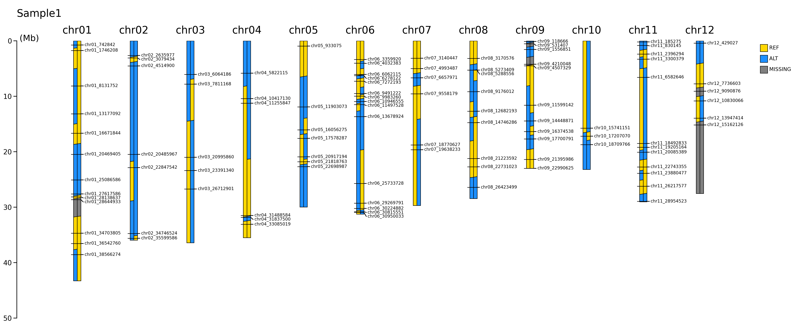
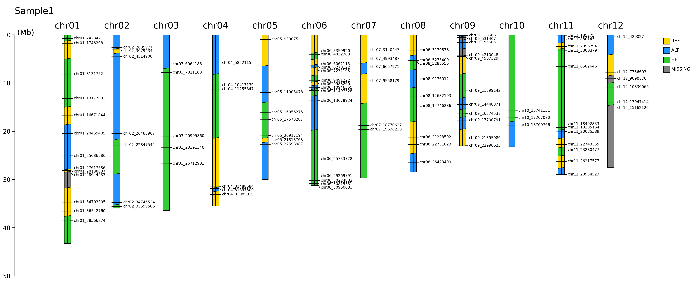
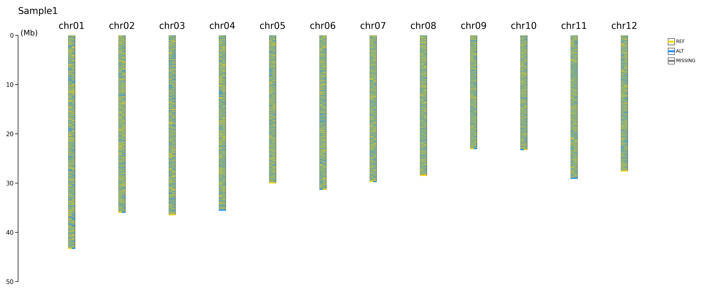
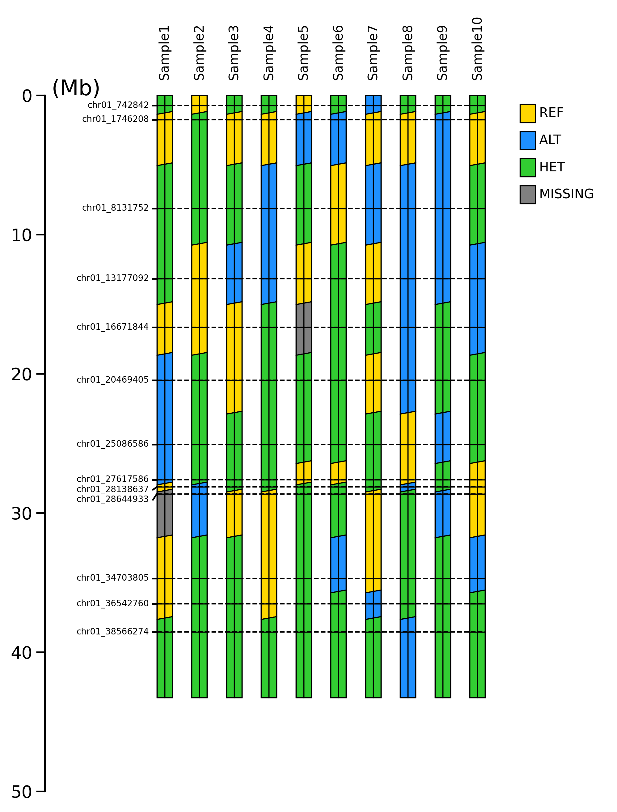
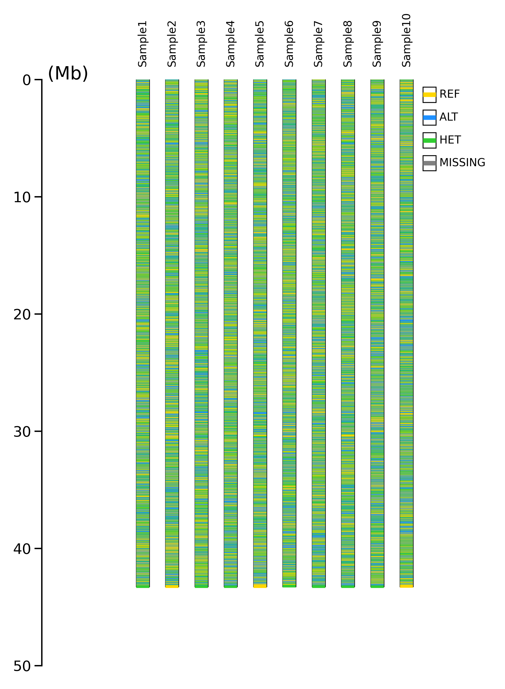
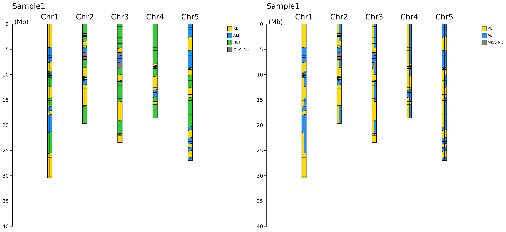
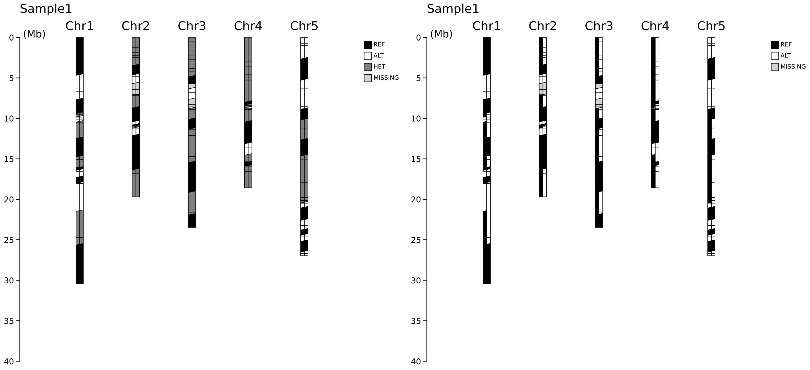
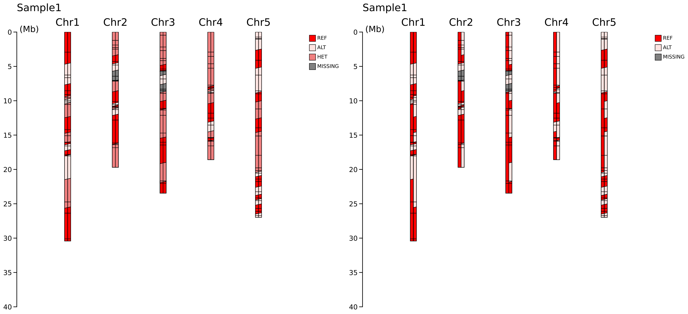

# A high-quality visualization tool for graphical genotypes


## Citation
Hashimoto (2024) GenoSee: A Novel Visualization Tool for Graphical Genotypes, **_Breeding Science_** 74(5): 454-461, [https://doi.org/10.1270/jsbbs.24041](https://doi.org/10.1270/jsbbs.24041).

<p align="right">
  
</p>

## Getting Started
### Installation

You can git clone the Github repo and install it locally with the following:

```
git clone https://github.com/hashimotoshumpei/GenoSee.git
cd GenoSee
python GenoSee.py --help
```

### Requirement

* Python3 (version 3.6 or later) - Install Python3 here: [[https://www.python.org/downloads/](https://www.python.org/downloads/)]. Check version with: `python --version`.
* matplotlib
* numpy
* pandas
* tqdm

 These required libraries can be installed all at once using pip as follows.

`pip install -r requirements.txt`

### Input data

You can use three formats as input data.

#### 1. Simple genotype

|  chr  |  marker_name  |   pos   | sample1 | sample2 | sample3 |
| :---: | :------------: | :------: | :-----: | :-----: | :-----: |
| chr01 | chr01_2164990 | 2164990 |    B    |    H    |    N    |
| chr01 | chr01_14286902 | 14286902 |    A    |    B    |    B    |
| chr01 | chr01_26873546 | 26873546 |    H    |    A    |    H    |
| chr02 | chr02_1158460 | 1158460 |    H    |    H    |    A    |
| chr02 | chr02_6600182 | 6600182 |    N    |    H    |    A    |
|  ...  |      ...      |   ...   |   ...   |   ...   |   ...   |

#### 2. Phased genotype

|  chr  |  marker_name  |   pos   | sample1 | sample2 | sample3 |
| :---: | :------------: | :------: | :-----: | :-----: | :-----: |
| chr01 | chr01_2164990 | 2164990 |  1\|1  |  1\|0  |  .\|.  |
| chr01 | chr01_14286902 | 14286902 |  0\|0  |  1\|1  |  1\|1  |
| chr01 | chr01_26873546 | 26873546 |  0\|1  |  0\|0  |  0\|1  |
| chr02 | chr02_1158460 | 1158460 |  1\|0  |  1\|0  |  0\|0  |
| chr02 | chr02_6600182 | 6600182 |  .\|.  |  1\|0  |  0\|0  |
|  ...  |      ...      |   ...   |   ...   |   ...   |   ...   |

#### 3. Non-phased genotype

|  chr  |  marker_name  |   pos   | sample1 | sample2 | sample3 |
| :---: | :------------: | :------: | :-----: | :-----: | :-----: |
| chr01 | chr01_2164990 | 2164990 |   1/1   |   1/0   |   ./.   |
| chr01 | chr01_14286902 | 14286902 |   0/0   |   1/1   |   1/1   |
| chr01 | chr01_26873546 | 26873546 |   0/1   |   0/0   |   0/1   |
| chr02 | chr02_1158460 | 1158460 |   1/0   |   1/0   |   0/0   |
| chr02 | chr02_6600182 | 6600182 |   ./.   |   1/0   |   0/0   |
|  ...  |      ...      |   ...   |   ...   |   ...   |   ...   |

>[!IMPORTANT]
>In this version of GenoSee, multi-allelic sites are NOT supported (i.e., genotypes such as 0/2 and 1/3 are not allowed for analysis).
>To remove multi-allelic sites from an original VCF, you can use bcftools (https://samtools.github.io/bcftools/bcftools.html).
>`bcftools view --max-alleles 2 input.vcf.gz`

### Options

Here is a list of the arguments that can be used with this tool.

| Flag                  | Description                                                   |
| --------------------- | ------------------------------------------------------------- |
| `-h`, `--help`    | Displays this help message and basic documentation.           |
| `-i`, `--input`   | Specifies the file path of the input CSV file [required].     |
| `-s`, `--species` | Name of species to be analyzed [required].                    |
| `-o`, `--output`  | Specifies the file path of the output image file.             |
| `--fill`            | Fill between markers [default: on].                          |
| `--drawing_mode`    | Selects the drawing mode: normal, compare or zoomed [default: normal].  |
| `--coloring_mode`      | Selects the color mode: 2-color or 3-color [default: 2-color] |
| `--display_marker_names` | Adds marker names at each position [default: on].             |
| `--chr`             | Chromosome number of the region to zoom in.                    |
| `--start`           |  Start position of the region to zoom in.                       |
| `--end`             |  End position of the region to zoom in.                          |
| `--dpi`             |   dpi of the output image(s).                                   |

## Examples

### 1. Chromosome-wide graphical genotype

```
python GenoSee.py --input ./examples/Oryza_sativa_phased_100_markers_10_samples.csv --species Oryza_sativa
```



```
python GenoSee.py --input ./examples/Oryza_sativa_phased_100_markers_10_samples.csv --species Oryza_sativa --coloring_mode 3-color
```



```
python GenoSee.py --input ./examples/Oryza_sativa_phased_100000_markers_10_samples.csv --species Oryza_sativa --display_marker_names off --fill off
```



### 2. Comparison graphical genotype

```
python GenoSee.py --input ./examples/Oryza_sativa_phased_100_markers_10_samples.csv --species Oryza_sativa --drawing_mode compare 
```


```
python GenoSee.py --input ./examples/Oryza_sativa_phased_100_markers_10_samples.csv --species Oryza_sativa --drawing_mode compare --coloring_mode 3-color
```



```
python GenoSee.py --input ./examples/Oryza_sativa_phased_100000_markers_10_samples.csv --species Oryza_sativa --drawing_mode compare --coloring_mode 3-color --display_marker_names off --fill off
```



### 3. Local comparison graphical genotype

```
python GenoSee.py --input=./examples/Triticum_aestivum_simple_100000_markers_10_samples.csv --species=Triticum_aestivum --drawing_mode=zoomed --display_marker_names=on --chr=Chr1A --start=1000000 --end=2000000
```


## Hints

### What species are supported ?

The lengths of each chromosome for the following species are pre-registered in the database (chromosome_length.json)

* *Oryza sativa*
* *Sorghum bicolor*
* *Zea mays*
* *Triticum aestivum*
* *Hordeum vulgare*
* *Glycine max*
* *Solanum lycopersicum*
* *Arabidopsis thaliana*

### How to add new species ?

You can add chromosome lengths of new species from genome fasta file by using `add_chromosome_lengths.py` in this repo like this;

```python add_chromosome_lengths.py path/to/your/file.fasta.gz path/to/your/chromosome_length_database.json your_species_name```

>[!NOTE]
>BioPython package needs to be installed before use.
>
>`pip install BioPython`

### How to make an input format from a VCF file ?

By using `make_input_file_from_VCF.py`, you can create an input file for GenoSee from a VCF file.

```python make_input_file_from_VCF.py path/to/your/VCF```

>[!NOTE]
>PyVCF package needs to be installed before use.
>
>`pip install PyVCF`

### How to custamize visualization results ?

You can adjust the output diagram by directly modifying the variables within the functions responsible for each drawing mode. Each drawing mode corresponds to the following functions in `plotting.py`.

| Drawing Mode | Responsible Function Name |
| ------------ | ------------------------- |
| normal       | create_normal_plot        |
| compare      | create_comparison_plot    |
| zoomed       | create_zoomed_plot        |

Adjustable variables correspond to the following elements within the diagram.


### What color sets are used to visualize ?

Following color pallettes are pre-registered in the database (color_set.json)
* normal

* grays

* reds

* blues


### How to add new color sets ?

By editing `color_set.json` directly, you can use new color sets for visualization. Please run  `GenoSee.py` with `--color_palette` as an argument like `--color_palette new_color_set` . In this version of GenoSee, The specification of the color set is somewhat redundant. "0|0", "1|1", "0|1" and ".|." are used in the `3-color` mode, whereas "0", "1" and "." are used in the `2-color` mode.

```
"normal": {
        "0|0": "gold",
        "1|1": "dodgerblue",
        "0": "gold",
        "1": "dodgerblue",
        "0|1": "limegreen",
        ".|.": "gray",
        ".": "gray"
}
```
### What is ColabGenoSee ?

ColabGenoSee is the Google Colab version of GenoSee.
To use ColabGenoSee, first move the ColabGenoSee folder to your Google Drive, then open ColabGenoSee.ipynb in Google Colab and run it.
